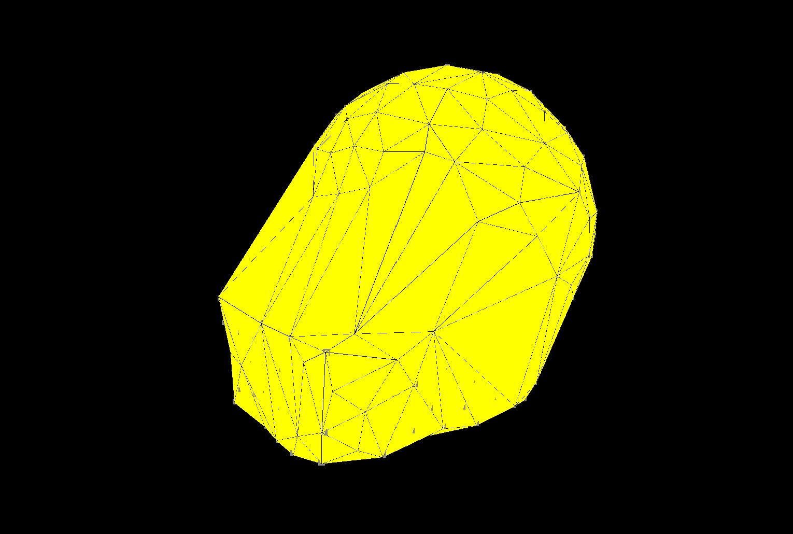

# Alpha Wrap for Javascript
Port CGAL::alpha_shape_3 to Javascript using Emscripten

(everything is under construction)

## Build for first time
```
python3 /home/wsl/emscripten/tools/webidl_binder.py ./alpha_wrap.idl alpha_wrap_glue

cmake --build . --target alpha_wrap
```

## Build for web
```
cd build
cmake --build . --target alpha_wrap
```
`alpha_wrap.js` and `alpha_wrap.wasm` will be generated.


## Run the C++ test
```
cd cmake-build-debug
cmake .. && cmake --build .
./alpha_wrap_test
```

## Run the example web page
```
cd example
python3 -m http.server 8000
```
Then open http://localhost:8000 in your browser.

## Example
- Before wrapping

- After wrapping



## CGAL Fixes for WebAssembly

Porting CGAL to WebAssembly via Emscripten required solving several issues related to floating-point predicate evaluation. Below is a summary of the problems encountered and how they were resolved.

### Problem: `orientation()` returns wrong results in WASM

CGAL's `Exact_predicates_inexact_constructions_kernel` (EPICK) relies on a filtered predicate chain:

1. **Static filter** — fast compile-time error bound check
2. **Interval filter** (`Interval_nt`) — uses FPU rounding mode control to compute tight upper/lower bounds
3. **Exact fallback** — arbitrary-precision arithmetic via GMP/MPFR

The interval filter (step 2) switches the FPU to **round-upward** mode to compute upper bounds and **round-downward** for lower bounds. WebAssembly does **not support FPU rounding mode control** — it always uses round-to-nearest. This means:

- Intervals computed in WASM are too tight (both bounds are round-to-nearest instead of being widened)
- Near-zero determinants get a collapsed interval like `[-3.73e-09; -3.73e-09]` instead of the correct `[-3.73e-08; 2.98e-08]`
- The filter incorrectly certifies a sign, skipping the exact fallback
- This causes `orientation()` to return wrong results, corrupting the Delaunay triangulation

### Solution: `CGAL_ALWAYS_ROUND_TO_NEAREST`

CGAL provides the `CGAL_ALWAYS_ROUND_TO_NEAREST` compile flag for environments without rounding mode control. When enabled, `IA_up()` in `FPU.h` uses `nextafter(d, infinity)` instead of relying on the hardware rounding mode:

```cpp
// FPU.h — with CGAL_ALWAYS_ROUND_TO_NEAREST
inline double IA_up(double d) {
    return nextafter(d, std::numeric_limits<double>::infinity());
}
```

This produces wider (conservative) intervals that always contain the true value. When the interval contains zero, the filter correctly returns UNCERTAIN and falls back to exact computation.

### Solution: Enable C++ exception handling in Emscripten

CGAL's `Filtered_predicate` uses a try/catch mechanism: when the interval filter can't determine a sign, it throws `Uncertain_conversion_exception`, which is caught to trigger the exact fallback. Emscripten disables C++ exception handling by default, which causes an abort instead of a fallback.

Fix: add `-fexceptions` to compile flags and `-sNO_DISABLE_EXCEPTION_CATCHING` to link flags.

### CMakeLists.txt configuration

These defines must be set **only for the Emscripten build** (not for native builds, which have proper FPU support):

```cmake
if (DEFINED EMSCRIPTEN)
    add_definitions(-DCGAL_DISABLE_ROUNDING_MATH_CHECK)
    add_definitions(-DCGAL_ALWAYS_ROUND_TO_NEAREST)
    # ...
    set_target_properties(alpha_wrap PROPERTIES COMPILE_FLAGS "... -fexceptions ...")
    set_target_properties(alpha_wrap PROPERTIES LINK_FLAGS "... -sNO_DISABLE_EXCEPTION_CATCHING ...")
endif()
```

Do **not** define `CGAL_ALWAYS_ROUND_TO_NEAREST` globally — it changes interval arithmetic behavior for native builds and can cause precondition failures there.

Also do **not** manually define `CGAL_USE_SSE2` — CGAL auto-detects it, and it conflicts with `CGAL_ALWAYS_ROUND_TO_NEAREST` (see `FPU.h` line ~120).

## Reference
- [Official tutorial](https://emscripten.org/docs/porting/connecting_cpp_and_javascript/WebIDL-Binder.html)
- [Another tutorial (Chinese)](https://874656645.github.io/posts/159-emscripten-%E4%BD%BF%E7%94%A8-webidl-binder-%E7%BB%91%E5%AE%9A-c++-%E4%BB%A3%E7%A0%81/)
- [GMP, MPFR](https://stackoverflow.com/questions/41080815/compiling-gmp-mpfr-with-emscripten)
- [Export as ES6 module](https://stackoverflow.com/questions/53309095/how-load-an-emscripten-generated-module-with-es6-import)
- [three.js setup template](https://medium.com/@ashabb/threejs-fullscreen-and-resizing-6aa84e21f407)